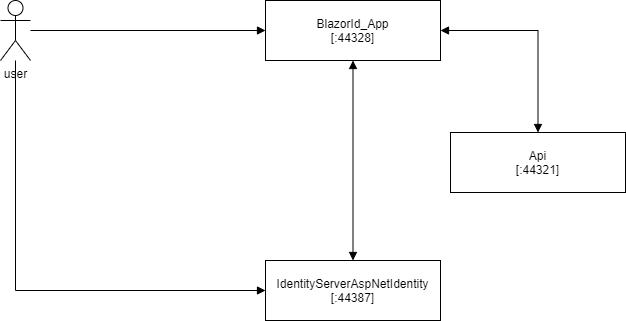
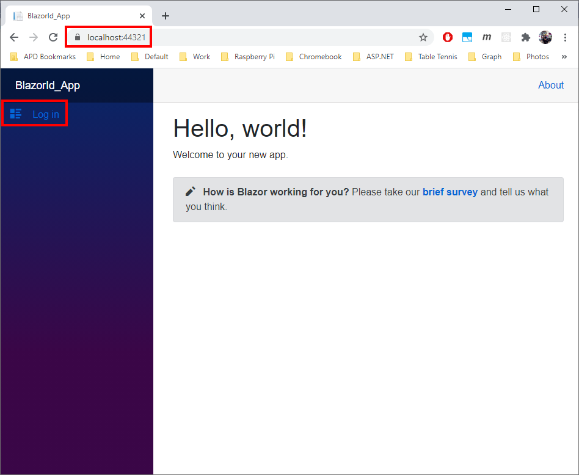
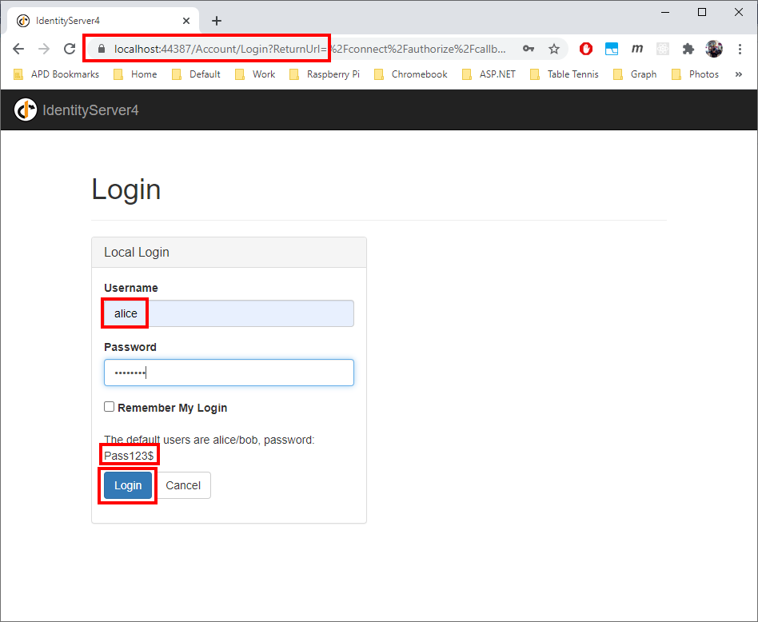
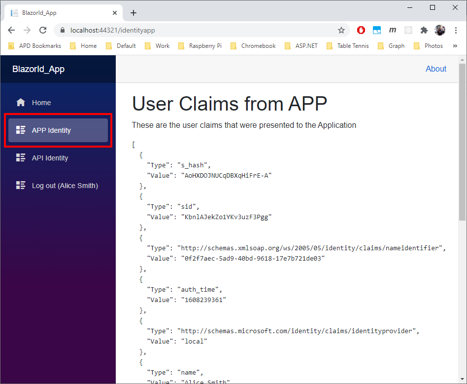
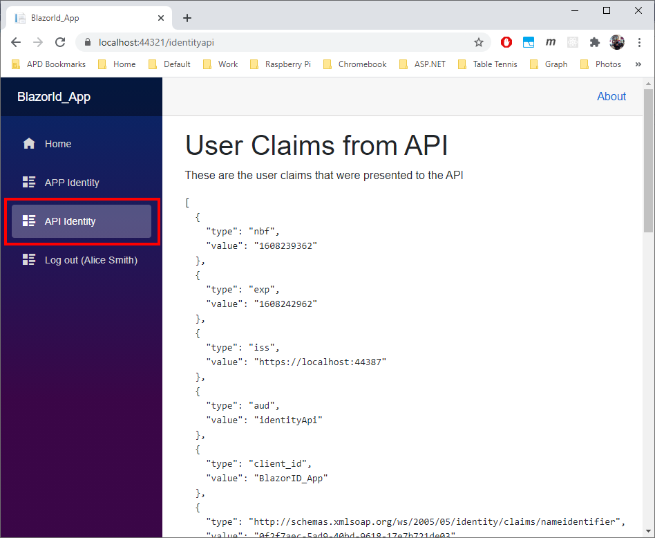
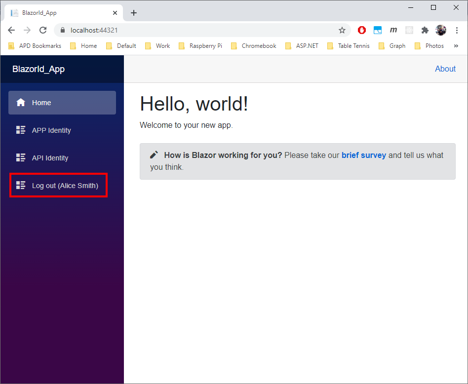
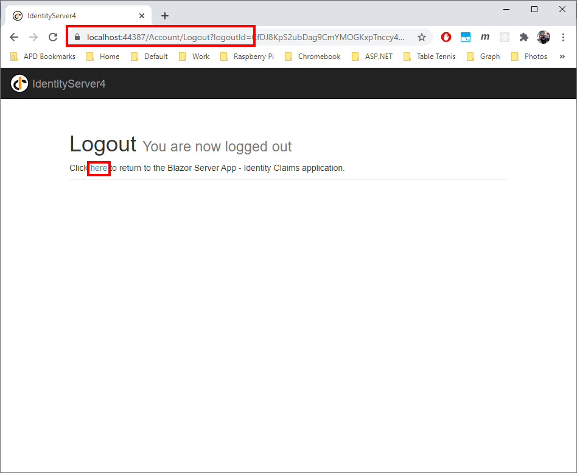

# BlazorId_App

**Sample Blazor Server Application (with IdentityServer and API)<br/>**
This example solution demonstrates how to:
* Integrate a Blazor Server application with IdentityServer and ASP.NET Identity using auth code flow with PKCE protection.
* Configure a custom user claim in Identity Server and propagate it to the application cookie during user authentication.
* Include the custom user claim in the access token when calling the API.

# Features

<details>

This application provides two protected features that allow the user to view all claims that have been assigned, and to 
differentiate between the Application user claims set and the API user claims set.

### APP Identity 
Navigation Menu Item: displays the claims of the current User identity for the application.<br/> 

### API Identity 
Navigation Menu Item: calls a test API, which is protected by IdentityServer. The API will return the user claims it 
received with the request as JSON. The application then displays those claims to the User. 

### Authorization
The sample solution demonstrates 4 layers of security:
1. **Application Routing:** Block application route paths for unauthorized users 
2. **Application Navigation:** Hide navigation links for unauthorized users
3. **API User** Deny API access to unauthorized users
4. **API Client** Deny API access to unauthorized clients

</details>

# Architecture

<details>



</details>

# Screenshots

<details>








</details>

# Step 1 IdentityServer Configuration

<details>

## Create IdentityServer project
Create the IdentityServer project using the IdentityServer and .NET Identity project template **is4aspid**<br/>
```shell
dotnet new is4aspid -n IdentityServerAspNetIdentity
```

## User with custom claim
Users and claims for testing are created in SeedData.cs. <br/>
For the Alice user only, add a custom claim of type appUser_claim with value **identity**<br/><br/>

**SeedData.cs**<br/>
```c#
result = userMgr.AddClaimsAsync(alice, new Claim[]{
             new Claim(JwtClaimTypes.GivenName, "Alice"),
             new Claim(JwtClaimTypes.FamilyName, "Smith"),
             new Claim(JwtClaimTypes.Email, "AliceSmith@email.com"),
             new Claim(JwtClaimTypes.EmailVerified, "true", ClaimValueTypes.Boolean),
             new Claim(JwtClaimTypes.WebSite, "http://alice.com"),
             new Claim(JwtClaimTypes.Address,
             @"{ 'street_address': 'One Hacker Way', 'locality': 'Heidelberg', \
             'postal_code': 69118, 'country': 'Germany' }",
             IdentityServer4.IdentityServerConstants.ClaimValueTypes.Json),
             
             // Add user_scope claim for Identity to authorize UI and API actions.
             // Alice has this claim, Bob does not.
             new Claim("appUser_claim","identity")

```

## Identity Resource
A custom Identity Resource is required in IdentityServer to control access to the custom claim type **appUser_claim**  for client applications and apis.<br/><br/>

**Config.cs**<br/>
```c#
new List<IdentityResource>
{
    new IdentityResources.OpenId(),
    new IdentityResources.Profile(),
    new IdentityResources.Email(),
    // Identity Resource for custom user claim type
    new IdentityResource("appUser_claim", new []{"appUser_claim"})
};
```

## Api Resource
A custom API Resource is required in IdentityServer to control access to the API and specify 
which user claims should be included in the access token.<br/><br/>

**Config.cs**<br/>
```c#
new List<ApiResource>
{
    // Identity API, consumes user claim type 'appUser_claim'
    // Claim Types are the associated user claim types required by this resource (api).
    // Identity Server will include those claims in Access tokens for this resource when available.
    new ApiResource(
        "identityApi",              // Name
        "Identity Claims Api",      // Display Name
        new []{"appUser_claim"})   // Claim Types
};
```

## Client
A client must be configured in Identity Server that has access to the API Resource and the Identity Resource.<br/><br/>

**Config.cs**<br/>
```c#
// interactive ASP.NET Core Blazor Server Client
new Client
{
   ClientId = "BlazorID_App",
   ClientName="Blazor Server App - Identity Claims",
   ClientSecrets = { new Secret("secret".Sha256()) },

   // Use Code flow with PKCE (most secure)
   AllowedGrantTypes = GrantTypes.Code,
   RequirePkce = true,
        
   // Do not require the user to give consent
   RequireConsent = false,                   
    
   // where to redirect to after login
   RedirectUris = { "https://localhost:44321/signin-oidc" },

   // where to redirect to after logout
   PostLogoutRedirectUris = { "https://localhost:44321/signout-callback-oidc" },

   // Allowed Scopes - include Api Resources and Identity Resources that may be accessed by this client
   // The identityApi scope provides access to the API, the appUser_claim scope provides access to the 
   // custom Identity Resource
   AllowedScopes = { "openid", "profile", "email", "identityApi","appUser_claim" },

   // AllowOfflineAccess includes the refresh token
   // The application will get a new access token after the old one expires without forcing the user 
   // to sign in again.
   // Token management is done by the middleware, but the client must be allowed access here and the 
   // offline_access scope must be added in the OIDC settings in client Startup.ConfigureServices
   AllowOfflineAccess = true
}
 ```

</details>

# Step 2 Configure the API

<details>

 The demo API was created from the standard ASP.NET Core Web API template.
 ```shell
 dotnet new web -n Api
 ```

## IdentityController
 Add a new Controller to the project named IdentityController with the following code:
 ```c#
//create base controller route
[Route("api/identity")]

// This authorize attribute challenges all clients attempting to access all controller methods.
// Clients must posses the client scope claim "identityApi" (api resource in IdentityServer)
// It is not actually required in this specific case, because there is only one method and it has 
// its own Authorize attribute.
// However, it is a common practice to have this controller level attribute to ensure that 
// Identity Server is protecting the entire controller, including methods that may be added in the
// future.
[Authorize]
public class IdentityController : ControllerBase
{
    [HttpGet]
    // Use authorization to protect the api GET method that is used to protect the application feature
    [Authorize]
    public IActionResult Get()
    {
        // return the claim set of the current API user as Json
        return new JsonResult(from c in User.Claims select new { c.Type, c.Value });
    }
}
 ```

## Startup.ConfigureServices
```c#
    services
        .AddControllers()
        .AddNewtonsoftJson();

    // configure bearer token authentication
    services
        .AddAuthentication("Bearer")
        .AddJwtBearer("Bearer", options =>
        {
            // IdentityServer url
            options.Authority = "https://localhost:44387";
            
            // RequireHttpsMetadata must be true in production
            options.RequireHttpsMetadata = false;

            // Audience is api Resource name
            options.Audience = "identityApi";
        });
 ```

## Startup.Configure
```c#
public void Configure(IApplicationBuilder app)
{
    app.UseRouting();

    // add authentication first, followed by authorization
    // these two should come after app.UseRouting but before app.UseEndpoints
    app.UseAuthentication();
    app.UseAuthorization();
    
    app.UseEndpoints(endpoints =>
    {
        endpoints.MapControllers();
    });
}
```

</details>

 # Step 3 Configure the Blazor Server Application

 <details>

 The demo Blazor Server App was created from the standard ASP.NET Core Blazor Server template.
 ```shell
 dotnet new blazorserver -n BlazorId_App
 ```

## OIDC Settings

<details>

### Startup.ConfigureServices
 **Configure Authentication (OIDC) and Authorization services**
 ```c#
services.AddAuthentication(options =>
{
    // the application's main authentication scheme will be cookies
    options.DefaultScheme = CookieAuthenticationDefaults.AuthenticationScheme;
    
    // the authentication challenge will be handled by the OIDC middleware, and ultimately 
    // IdentityServer  
    options.DefaultChallengeScheme = OpenIdConnectDefaults.AuthenticationScheme;
})
.AddCookie(CookieAuthenticationDefaults.AuthenticationScheme)
.AddOpenIdConnect(OpenIdConnectDefaults.AuthenticationScheme,
options =>
{
    options.Authority = "https://localhost:44387/";
    options.ClientId = "BlazorID_App";
    options.ClientSecret = "secret";
    options.UsePkce = true;
    options.ResponseType = "code";
    options.Scope.Add("openid");
    options.Scope.Add("profile");
    options.Scope.Add("email");
    options.Scope.Add("offline_access");

    //Scope for accessing API
    options.Scope.Add("identityApi"); 

    // Scope for custom user claim
    options.Scope.Add("appUser_claim"); 

    // map custom user claim 
    options.ClaimActions.MapUniqueJsonKey("appUser_claim", "appUser_claim");
   
    //options.CallbackPath = ...
    options.SaveTokens = true;
    options.GetClaimsFromUserInfoEndpoint = true;
});
...
 ```

### Startup.Configure
  **Add services to the request pipeline in correct processing order:**
  1. UseStaticFiles 
  2. UseRouting
  3. UseAuthentication
  4. UseAuthorization
  5. UseEndpoints

```c#
if (env.IsDevelopment())
{
    app.UseDeveloperExceptionPage();
}
else
{
    app.UseExceptionHandler("/Error");
    app.UseHsts();
}

app.UseHttpsRedirection();
app.UseStaticFiles();
app.UseRouting();

// add authentication first, followed by authorization
// these should come after app.UseRouting and before app.UseEndpoints
app.UseAuthentication();
app.UseAuthorization();
app.UseEndpoints(endpoints =>
{
    endpoints.MapBlazorHub();
    endpoints.MapFallbackToPage("/_Host");
});
```

</details>

## Logging in and out

<details>

 A Blazor component cannot correctly redirect to the IdentityServer Login and Login functions on its own.<br/><br/>
 For signing in and out, the HttpResponse must be modified by adding a cookie - but a pure Blazor component starts the response immediately when it  is rendered and it cannot be changed afterward.<br/><br/>
 An intermediary razor page (or MVC view) must be used to interact with the OIDC middleware for logging in and out because the page is able to manipulate the response correctly before sending it.<br/><br/>
 These pages have a cs file only, with no markup code, and each has a single Get method that performs the required actions. <br/><br/>
 The real login and logout pages are centrally located in Identity Server.
 
### LoginIDP.cshtml.cs
The LoginIDP page invokes the ChallengeAsync method on the OIDC scheme, triggering the redirect to IdentityServer for Authentication.

```c#
public async Task OnGetAsync()
{
    if (!HttpContext.User.Identity.IsAuthenticated)
    {
        //Call the challenge on the OIDC scheme and trigger the redirect to IdentityServer
        await HttpContext.ChallengeAsync(OpenIdConnectDefaults.AuthenticationScheme);
    }
    else
    {
        // redirect to the root
        Response.Redirect(Url.Content("~/").ToString());
    }
}
```

### LogoutIDP.Razor
**The LogoutIDP page invokes the SignOutAsync method for both Authentication Schemes (Cookies and OIDC)**

```c#
public async Task OnGetAsync()
{
    // Sign out of Cookies and OIDC schemes
    await HttpContext.SignOutAsync(CookieAuthenticationDefaults.AuthenticationScheme);
    await HttpContext.SignOutAsync(OpenIdConnectDefaults.AuthenticationScheme);
}
```

### BlazorRazor Razor Class Library
**This sample project is using LoginIDP and LogoutIDP razor pages provided by Nuget package
[BlazorRazor](https://www.nuget.org/packages/BlazorRazor/)**<br/>

**BlazorID_App.csproj**<br/>
  ```xml
  <ItemGroup>
    <PackageReference Include="BlazorRazor" Version="1.0.0" />
```

After referencing this nuget package, simply direct logins to "/LoginIDP" and logouts to "/LogoutIDP". <br/>
**\_NavMenu.razor**
```xml
   <NavLink class="nav-link" href="/LoginIDP"> Log in </NavLink>
   <NavLink class="nav-link" href="/LogoutIDP"> Log out </NavLink>
```

</details>

## Using Authentication and Authorization in the UI 
 
 <details>

### Authorize attribute
* Razor components support the use of Authorize attributes to trigger authorization checks on the component.<br/>
* Authorization results are cascaded down through all children of **CascasdingAuthenticationState**.<br/><br/>

**Identity-Api.razor**
* The Authorize attribute in the Identity-Api component performs an Authorization check when a user attempts to access the component.

```razor
@page "/identityapi"
@attribute [Authorize]
```

### CascadingAuthenticationState Component
* Authentication in SignalR apps is established with the initial connection. 
* The CascadingAuthenticationState component receives the authentication information upon intial connection and cascades this information to all descendant components.<br/><br/>  

### AuthorizeRouteView component 
* Configured in App.razor
* Controls access to application routes based on the user's authorization status. <br/>
* Prevents direct navigation to an unauthorized page by entering the URI in the browser. 
* The protected component must contain the @Page directive meaning it is a routable component.
* The protected component must contain an Authorization attribute that is used to the generate authorization status.
* **AuthorizeRouteView** is configured in the **App.Razor** file. <br/><br/>

**App.razor**<br/>
* The AuthorizeRouteView element is wrapped in the **CascadingAuthenticationState** element, and thus can access the authentication and authorization status data.
* When the authorization fails, the code in the **NotAuthorized** element is activated and a denial message is returned to the caller instead of the page.
* When the authorization succeeds, the code in the **NotAuthorized** element is **not** activated and the requeste is returned as usual.<br/>

```xml
<CascadingAuthenticationState>
    <Router AppAssembly="@typeof(Program).Assembly">
        <Found Context="routeData">
            <AuthorizeRouteView RouteData="@routeData" DefaultLayout="@typeof(MainLayout)">
                <NotAuthorized>
                    <h1>Sorry, you're not authorized to view this page.</h1>
                    <p>You may want to try logging in (as someone with the necessary authorization).</p>
                </NotAuthorized>
            </AuthorizeRouteView>
        </Found>
        <NotFound>
            <LayoutView Layout="@typeof(MainLayout)">
                <p>Sorry, there's nothing at this address.</p>
            </LayoutView>
        </NotFound>
    </Router>
</CascadingAuthenticationState>
```

### **AuthorizeView Component**
 * Organizes razor code into two sections, **Authorized** and **NotAuthorized**
 * When authorization succeeds, the code in the **Authorized** section is activated and the markup content generated within that section will be rendered.
 * When the authorization fails, the code in the **NotAuthorized** section is activated and the razor code within that section will be rendered.
 * Used in NavMenu.razor to hide navigation links for unauthorized users. <br/>
 
 **NavMenu.razor** <br/>
 *    The authorized user sees all Links except Login
 *    The unauthorized user only sees the Login link 

```html
 <div class="@NavMenuCssClass" @onclick="ToggleNavMenu">
    <ul class="nav flex-column">
        <AuthorizeView>
            <Authorized>
                <li class="nav-item px-3">
                    <NavLink class="nav-link"
                             href="/" Match="NavLinkMatch.All">
                        <span class="oi oi-home" aria-hidden="true"></span> Home
                    </NavLink>
                </li>
                <li class="nav-item px-3">
                    <NavLink class="nav-link" href="identityapp">
                        <span class="oi oi-list-rich" aria-hidden="true"></span> APP Identity
                    </NavLink>
                </li>
                <li class="nav-item px-3">
                    <NavLink class="nav-link" href="identityapi">
                        <span class="oi oi-list-rich" aria-hidden="true"></span> API Identity
                    </NavLink>
                </li>
                <li class="nav-item px-3">
                    <NavLink class="nav-link"
                             href="/LogoutIDP">
                        <span class="oi oi-list-rich" aria-hidden="true"></span> Log out
                        (@context.User.Claims.FirstOrDefault(c => c.Type == "name")?.Value)
                    </NavLink>
                </li>
            </Authorized>
            <NotAuthorized>
                <NavLink class="nav-link"
                         href="/LoginIDP">
                    <span class="oi oi-list-rich" aria-hidden="true"></span> Log in
                </NavLink>
            </NotAuthorized>
        </AuthorizeView>
    </ul>
</div>
```

</details>

</details>
